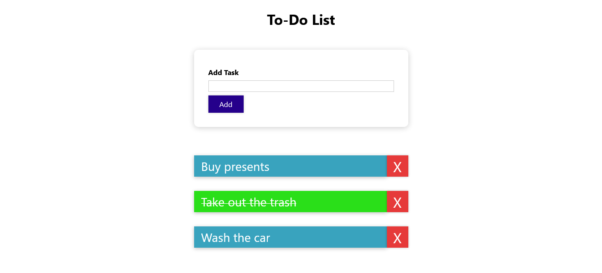

# To-Do List App

## Description:

This is a simple web application crated using React that allows users to create a list of tasks that persists in local storage.
New tasks can be added using the Add Task form. When the task is clicked it is crossed out and it's background color is changed to green to mark it as done. The red button next to each task can be used to delete it.

In the project directory, you can run:

### `npm install`

### `npm start`

 
Runs the app in the development mode.
Open http://www.localhost:3000 to view it in your browser.
